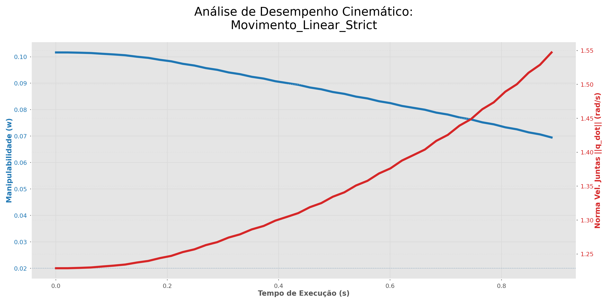

# Controle de Singularidades Cinemáticas — UR10 (URSim)

Este repositório contém três scripts em Python que demonstram diferentes estratégias de controle de um robô **UR10** ao se aproximar de uma **singularidade cinemática de punho**, usando o simulador oficial da Universal Robots (**URSim**) via protocolo **RTDE**.

## Estrutura do repositório

| Arquivo | O que é |
|---|---|
| `Resolvedores_Jacobianos.py` | **Biblioteca/módulo** com todas as funções de controle, telemetria e geração de gráficos. Não é executado diretamente — é importado pelos outros dois scripts. |
| `Main_testes.py` | **Script executável** — roda os 3 testes comparativos (linear ingênuo, DLS, malha fechada com espaço nulo) em sequência e gera o gráfico comparativo final. |
| `Teste_controlador_xpontos.py` | **Script executável** — roda uma navegação contínua por 4 waypoints usando o controlador de malha fechada com espaço nulo, gerando telemetria única do trajeto inteiro. |

---

## 1. Pré-requisitos

### 1.1. Software necessário
- **Python 3.8+**
- **URSim** (simulador da Universal Robots) rodando localmente ou em uma VM/Docker acessível pela rede.
- Bibliotecas Python:
  ```bash
  pip install numpy matplotlib roboticstoolbox-python ur-rtde ur-dashboard-client
  ```
  > Os pacotes `rtde_receive`, `rtde_control` e `dashboard_client` vêm do pacote **ur_rtde** (biblioteca oficial da UR para controle em tempo real).

### 1.2. Rodando o URSim via Docker (UR10 CB3)

O jeito mais rápido de ter o simulador rodando é usando a imagem Docker oficial `universalrobots/ursim_cb3`, que é a série usada pelo controlador **CB3** (a mesma linha do seu `robo_ur10 = rtb.models.UR10()`).

#### a) Instalar o Docker
- **Windows/Mac:** baixe e instale o **Docker Desktop** em https://www.docker.com/products/docker-desktop/
- **Linux:**
  ```bash
  curl -fsSL https://get.docker.com | sh
  sudo usermod -aG docker $USER
  ```
  (depois disso, faça logout/login para o usuário entrar no grupo `docker`)

Confirme a instalação:
```bash
docker --version
```

#### b) Baixar a imagem do URSim (CB3)
```bash
docker pull universalrobots/ursim_cb3
```

#### c) Subir o container com o modelo UR10
A variável de ambiente `ROBOT_MODEL` define o modelo do braço (`UR3`, `UR5` ou `UR10` na linha CB3). As portas expostas são:
- `5900` → acesso via cliente VNC tradicional
- `6080` → acesso via navegador (noVNC)
- `29999` → Dashboard Server (usado por `DashboardClient`)
- `30001-30004` → interfaces RTDE/URScript (usadas por `RTDEReceiveInterface`/`RTDEControlInterface`)

```bash
docker run --rm -it \
  -p 5900:5900 \
  -p 6080:6080 \
  -p 29999:29999 \
  -p 30001-30004:30001-30004 \
  -e ROBOT_MODEL=UR10 \
  --name ursim_ur10 \
  universalrobots/ursim_cb3
```

> No Windows (PowerShell), coloque tudo em uma linha só, sem as barras invertidas `\`.

Deixe esse terminal aberto — ele mostra os logs do container rodando em primeiro plano. Para encerrar, use `Ctrl+C` (a flag `--rm` já remove o container automaticamente ao parar).

#### d) Acessar a interface gráfica (Polyscope) pelo navegador
Com o container rodando, abra no navegador:
```
http://localhost:6080/vnc.html?host=localhost&port=6080
```
Clique em **Connect** (às vezes aparece um botão simples "Connect" no canto da página). Você verá a tela do Polyscope (a interface do robô real), já inicializando o simulador do UR10.

Na primeira vez, é comum precisar:
1. Aceitar/pular a tela de inicialização do controlador.
2. Ir em **"On/Off" → "ON" → "START"** dentro do Polyscope para ligar o robô virtual e liberar o modo **Remote Control**, que é o modo usado pelos scripts Python (via RTDE).

#### e) Confirmar o IP a usar nos scripts
Como o container está publicando as portas para `localhost`, mantenha nos scripts:
```python
robot_ip = "127.0.0.1"
```
Se você estiver rodando o Docker em outra máquina/VM da rede, troque `127.0.0.1` pelo IP dessa máquina.

---

## 2. Clonando o repositório

```bash
git clone <URL_DO_SEU_REPOSITORIO>
cd <NOME_DO_REPOSITORIO>
```

Certifique-se de que os três arquivos (`Resolvedores_Jacobianos.py`, `Main_testes.py`, `Teste_controlador_xpontos.py`) estão na **mesma pasta**, pois os dois scripts executáveis fazem `import Resolvedores_Jacobianos as singu`.

---

## 3. Configurando o IP do robô

Em `Main_testes.py` e em `Teste_controlador_xpontos.py`, ajuste a variável no topo do arquivo:

```python
robot_ip = "127.0.0.1"
```

Troque `"127.0.0.1"` pelo IP real do seu URSim, caso ele não esteja rodando na mesma máquina do script.

---

## 4. Como executar cada script

Com o URSim já rodando e em modo Remote Control, execute a partir da pasta do projeto:

### 4.1. `Main_testes.py`
```bash
python Main_testes.py
```
**O que ele roda:** compara três abordagens diferentes para o mesmo movimento cartesiano (mesmo ponto de partida e mesmo alvo):

1. **Teste 1 — Trajetória linear padrão:** tenta uma linha reta pura no espaço cartesiano. Deve **falhar de propósito**, detectando a singularidade (via manipulabilidade de Yoshikawa e velocidade de juntas) e freando o robô antes do colapso.
2. **Teste 2 — Pseudoinversa Amortecida (DLS):** usa amortecimento na inversão da Jacobiana para evitar velocidades absurdas de junta perto da singularidade, sacrificando um pouco a fidelidade da trajetória.
3. **Teste 3 — Controle em malha fechada com espaço nulo:** controlador proporcional em tempo real que desvia da singularidade e ainda usa o espaço nulo da Jacobiana para manter a postura das juntas próxima da configuração inicial.

Ao final, gera um **gráfico de barras comparativo** dos erros de posição/orientação dos três métodos (`Comparacao_Erros_Finais.png`, na pasta `Graficos_Resultados`).

### 4.2. `Teste_controlador_xpontos.py`
```bash
python Teste_controlador_xpontos.py
```
**O que ele roda:** usa **apenas** o controlador de malha fechada com espaço nulo (o mesmo do Teste 3 acima), mas aplicado a uma sequência de **4 waypoints** consecutivos (deslocamentos relativos à pose inicial), navegando de um ponto a outro sem parar o robô entre eles. Gera uma telemetria contínua do percurso inteiro e um único gráfico de manipulabilidade × velocidade de juntas ao longo do tempo (`Trajetoria_Continua_Waypoints.png`).

> Ambos os scripts salvam os gráficos automaticamente na pasta `Graficos_Resultados/`, criada no diretório de execução.

---

## 5. Encerramento seguro

Os dois scripts possuem um bloco `try/finally` que:
- Fecha popups e desbloqueia paradas de proteção do painel do robô;
- Para qualquer movimento em andamento (`speedStop`);
- Desconecta RTDE Receive, RTDE Control e Dashboard Client, mesmo em caso de erro ou `Ctrl+C`.

Você pode interromper qualquer teste a qualquer momento com `Ctrl+C` que o robô será parado com segurança.

---

## 6. Dica de organização no GitHub

Sugestão de estrutura de pastas para o repositório:

```
.
├── README.md
├── Resolvedores_Jacobianos.py
├── Main_testes.py
├── Teste_controlador_xpontos.py
└── Graficos_Resultados/     # gerado automaticamente ao rodar os testes
```

Adicione um `.gitignore` com:
```
Graficos_Resultados/
__pycache__/
*.pyc
```
para não versionar os gráficos gerados a cada execução.
---
## A. Fundamentação Teórica

O núcleo de todo o projeto é a **Jacobiana geométrica** do UR10, `J(q)`, uma matriz 6×6 que relaciona a velocidade das 6 juntas (`q̇`) com a velocidade linear e angular do efetuador (`ẋ`):

```
ẋ = J(q) · q̇
```

No código, ela é obtida diretamente pelo `roboticstoolbox` com `J = modelo_cinematico.jacob0(q)`, e suas propriedades são usadas em três frentes:

- **Determinante e manipulabilidade (índice de Yoshikawa):** como `J` é quadrada (6×6) apenas quando se considera posição + orientação, o código calcula
  ```python
  w = np.sqrt(max(0, np.linalg.det(J @ J.T)))
  ```
  O termo `J @ J.T` é sempre quadrado e positivo-semidefinido, mesmo quando se usa só a submatriz de posição (3×6). Fisicamente, `w` mede o "volume" do elipsoide de manipulabilidade: quanto mais próximo de zero, menos direções o robô consegue se mover livremente naquele instante — ou seja, mais perto de uma singularidade. É esse número que decide, em tempo real, se o robô está entrando em uma zona de risco.

- **Posto (rank) da matriz:** uma singularidade cinemática ocorre exatamente quando `J` perde posto — isto é, quando duas ou mais linhas/colunas se tornam linearmente dependentes e o robô não consegue mais gerar movimento em alguma direção cartesiana, não importa a combinação de velocidades de junta. É esse fenômeno que os testes tentam expor (Teste 1) ou contornar (Testes 2 e 3).

- **Transposição e a Pseudoinversa Amortecida (DLS):** perto da singularidade, a pseudoinversa comum (`J⁺ = Jᵀ(JJᵀ)⁻¹`) explode numericamente, pois `(JJᵀ)` se aproxima de uma matriz singular (não invertível). A solução implementada em `Pseudoinvers_amortecida` e no controlador de malha fechada soma um termo de amortecimento `λ²I` antes da inversão:
  ```python
  J_dls = J_v.T @ np.linalg.inv(J_v @ J_v.T + lambda_sq * Identidade_3x3)
  ```
  Esse `λ²` (calculado dinamicamente a partir de `w`) evita a divisão por um número quase zero, trocando um pouco de precisão de trajetória por estabilidade numérica — o clássico trade-off da técnica *Damped Least Squares*.

Em síntese, o determinante e o posto da Jacobiana constituem os principais indicadores da proximidade e da ocorrência de singularidades cinemáticas. A transposição da Jacobiana desempenha papel fundamental na formulação da pseudoinversa e, consequentemente, da pseudoinversa amortecida, utilizada para aumentar a robustez numérica do controlador em regiões críticas. Por fim, o espaço nulo da Jacobiana possibilita a incorporação de tarefas secundárias, como a otimização da postura do manipulador, sem comprometer o desempenho da tarefa primária de controle cartesiano.

---

## B. Arquitetura da Solução

O projeto foi dividido em **uma camada de lógica (biblioteca)** e **camadas de execução (scripts de teste)**, para permitir reaproveitar os mesmos algoritmos em diferentes cenários sem duplicar código:

- **`Resolvedores_Jacobianos.py` (camada de lógica):** concentra três tipos de responsabilidade:
  1. *Controle:* as três estratégias de movimento (`explorar_trajetoria_e_gravar`, `Pseudoinvers_amortecida`, `controlador_cartesiano_realtime`), todas seguindo o mesmo padrão de loop de controle (ver abaixo).
  2. *Utilidades de simulação:* `resetar_robo` (limpa alarmes, destrava paradas de proteção e reposiciona o robô) e `popup_temporizado` (feedback visual no painel do URSim).
  3. *Telemetria e gráficos:* `iniciar_telemetria`/`gravar_telemetria` (coleta de dados a cada ciclo) e `plotar_analise_cinematica`/`plotar_comparacao_erros` (geração dos relatórios visuais).

- **`Main_testes.py` e `Teste_controlador_xpontos.py` (camada de execução):** cada um importa o módulo (`import Resolvedores_Jacobianos as singu`) e apenas orquestra *qual* função chamar, com *quais* parâmetros, e em *que ordem* — sem reimplementar a lógica de controle.

**Comunicação com o URSim:** feita inteiramente via **RTDE** (Real-Time Data Exchange), o protocolo de rede oficial da Universal Robots, através de três interfaces:
- `RTDEReceiveInterface` → leitura do estado do robô a cada ciclo (`getActualQ()` para as juntas, `getActualTCPPose()` para a pose cartesiana do efetuador).
- `RTDEControlInterface` → envio de comandos de velocidade (`speedJ` no espaço de juntas, `speedL` no espaço cartesiano) e de posicionamento (`moveJ`).
- `DashboardClient` → controle do painel do robô (popups, liberação de paradas de proteção, religamento de scripts) por uma porta separada (Dashboard Server).

**Padrão do laço de controle** (repetido, com variações, nas três estratégias): a cada ciclo o código (1) lê o estado atual via RTDE, (2) calcula o erro cartesiano em relação ao alvo, (3) recalcula a Jacobiana e a manipulabilidade naquele ponto, (4) decide a velocidade de junta a enviar — reta, amortecida, ou com espaço nulo, dependendo do teste — (5) satura a velocidade por segurança e (6) envia o comando via RTDE, dormindo um pequeno intervalo (`time.sleep`) antes do próximo ciclo. Esse ciclo síncrono e determinístico é o que permite tanto reagir em tempo real a uma singularidade iminente quanto gravar a telemetria de cada instante.

---
## C. Análise dos dados


